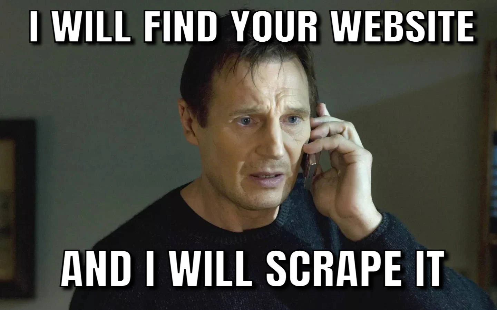

# Scrape Anything



## Disclaimer

1. Caution! This is a very **WIP** project! Use it at your own risk!
2. **I'm NOT responsible for any consequences caused by your usage of the code in any approach or format.**

## Usage

Install dependencies:
```shell
pip install -r requirements.txt
```

How to launch scrapers and customize your scrape tasks:

Check out the top-level code (the `if __name__ == "__main__":` block) in `*/*/scraper.py`s.


## Hacked/Will-be-hacked Websites

- [x] Mercari
    - [x] Keyword search
- [x] Vinted
    - [x] Keyword search
- [ ] Pinterest
    - [ ] Keyword search
- [ ] Pixiv
    - [ ] Tag search
    - [ ] Illustrator
    - [ ] Personal Collection

## LICENSE


